# Базовые принципы отладки

Очень часто новички пишут код, затем нажимают кнопку "выполнить" и получают результат. Если результат не такой, как ожидался, то возникают вопросы: почему код ведёт себя не так, как ожидалось? Где скрывается ошибка?

Бывают ситуации, что разработчику попадается унаследованный код и нужно разобраться как он выполняется. С выводом на консоль каких-нибудь данных - значения переменных могут помочь. Но если код слишком большой, то в этих логах можно запутаться, что за чем следует.

Итак, мы выявили общую проблему: есть код (свой или чужой), который нужно понять. Как он выполняется?

> **Отладка** – это процесс поиска и исправления ошибок в скрипте. Все современные браузеры и большинство других сред разработки поддерживают инструменты для отладки – специальный графический интерфейс, который сильно упрощает отладку. Он также позволяет по шагам отследить, что именно происходит в нашем коде.

Так как же начать отлаживать код?

## Начало отладки и остановка кода
Для того, что бы зайти в режим отладчика, необходимо открыть панель *DevTools* (Ctrl + Shift + I) в браузере, перейти на вкладку *Sources* (или сразу F12), открыть код и установить точку останова (`breakpoint`). Чтобы поставить точку останова следует нажать на позицию строки кода. Это будет место, с которого мы будем построчно проверять код и искать ошибку. При выполнении кода браузер остановит выполнение на точке останова.

*gif №1 - создание точки останова*

Либо в коде написать ключевое слово `debugger`:

*gif №2 - остановка кода с помощью **debugger***

## Пошаговое выполнение кода
С помощью точек останова вы смогли остановить выполнение кода. После остановки выполнять код можно по шагам, и можно это делать несколькими действиями. Все они отображены сверху справа.

После приостановки выполнения кода можно выполнить некоторые команды:

*изображение №1 - возможные действия выполнения*

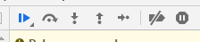

1) Продолжить выполнение. Быстрая клавиша – F8 (во время выполнения можно поставить на паузу). Продемонстрировано на `gif №2`.

2) Сделать шаг (выполнить следующую команду), не заходя в функцию. Быстрая клавиша – F10. 

На gif снизу представлено выполнение из функции `main` останавливаясь на 2 строке, затем переходя к следующей инструкции на строку 3, потом к следующей на строку 4, потом 5 и 6. После добавления `debugger` в функции `c` выполнение из функции `а` переходит к следующей инструкции, но точка останова внутри `c` останавливает выполнение, после которого выполнение кода по шагам будет возвращаться к функции `main` (через `b` и `a`).

*gif №3 - переход к следующей команде*
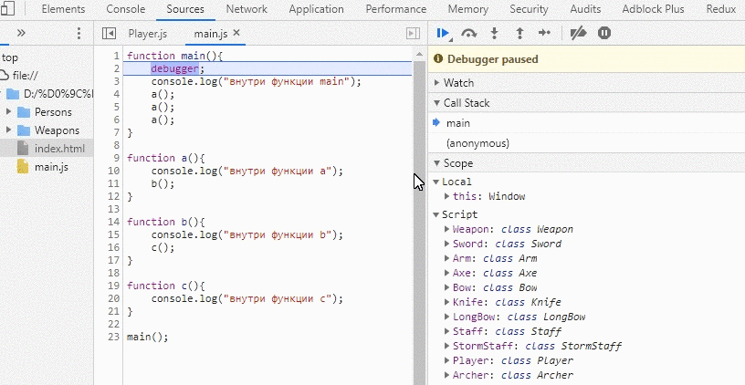

3) Сделать шаг. Быстрая клавиша – F11. В этом случае мы «заходим» во вложенные функции и шаг за шагом проходим по скрипту. 
На gif снизу представлено выполнение из функции `main` останавливаясь на 2 строке, затем происходит выполнение кода с заходом во все функции (обратите внимание, что во встроенные функции, такие как `console.log` выполнение не заходит).

*gif №4 - переход внутрь конструкции*
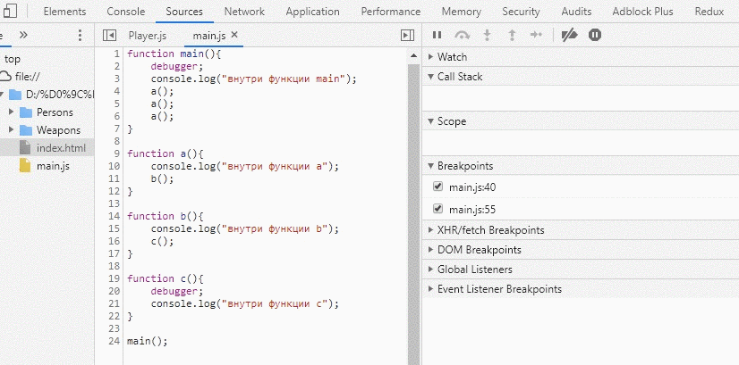

4) Продолжить выполнение до завершения текущей функции. Быстрая клавиша – Shift+F11 (выйти из функции). 
На gif снизу представлено выполнение из функции `main` останавливаясь на 2 строке, затем происходит выполнение кода с заходом в функцию `a` и выходом из неё. Следующий заход такой же. А последующий демонстрирует выход из функции `b`. Такой выход из конструкции часто применяется, когда во время отладки выполнение случайно зашло внутрь лишней функции и нужно из неё выйти.

*gif №5 - выход из конструкции*
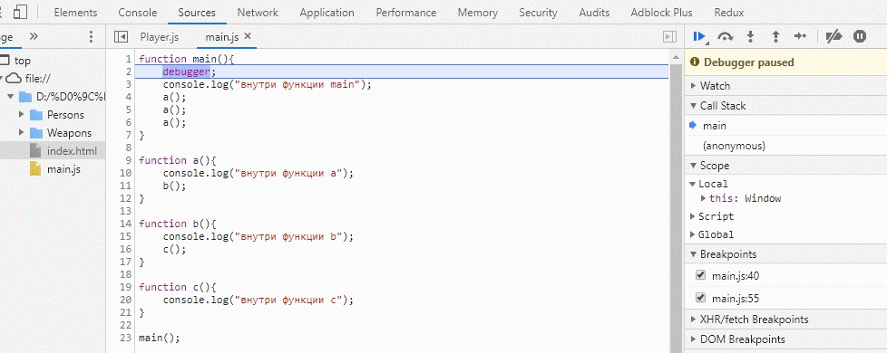

5) Новая кнопка сделать шаг внутрь. Эта новая кнопка «Шаг F9» работает так же, как и старая кнопка «шаг в». Только используется для отладки асинхронных функций [подробней](https://developers.google.com/web/updates/2018/01/devtools#async)

6) Активировать/деактивировать все точки останова. 
На gif снизу продемонстрировано выполнение кода от функции `main` внутрь функции `a`, затем внутрь `b`, после внутрь `c` с остановкой на каждом breakpoint. Затем отключаются все точки останова и код без остановок выполняется до функции `c`, где возникает ошибка.

*gif №6 - отключение точек останова*
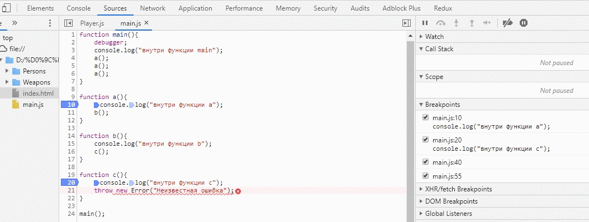

7) Разрешить/запретить остановку выполнения в случае возникновения ошибки. При остановке на ошибках (исключениях) появляется опция возможности остановки или пропуска перехватываемых (обрабатываемых) исключениях.
На gif снизу представлено 3 выполнения кода: первое без остановок, второе с остановками на перехватываемых исключениях (останавливается на перехватываемом исключении и неперехватываемом), третье останавливается только на неперехватываемом исключении.

*gif №7 - остановка на ошибках*
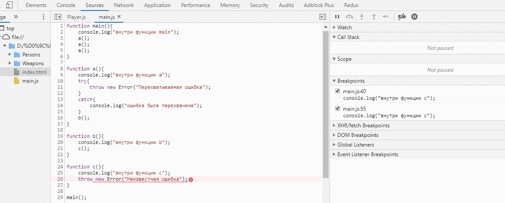

# Просмотр переменных и изменение переменных
Вот мы научились выполнять код по шагам и видеть как он выполняется. Но нужно знать какие значения хранятся в переменных. А иногда, при отладке хочется и подменить значения. Сделать это можно несколькими способами:

1) Просто навести курсор на нужную переменную и посмотреть или изменить её. Таким простым способом лучнице можно добавить 30000 здоровья.

*gif №8 - просмотр и изменение переменной наведением курсора*
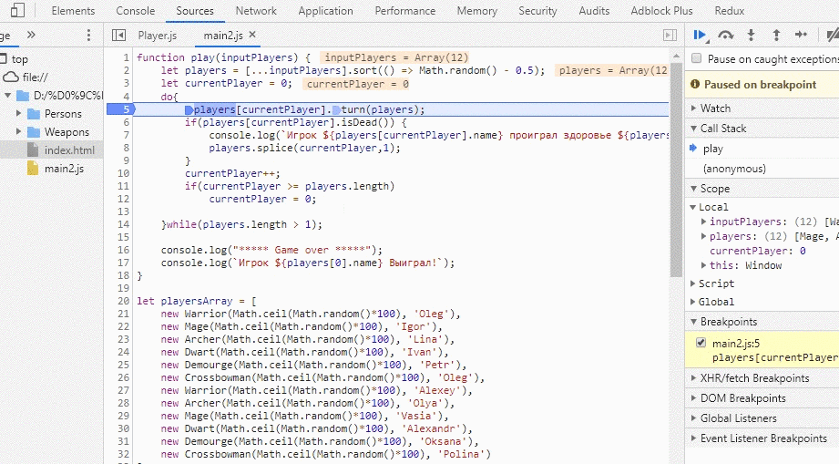

2) Посмотреть переменную в области Scope. Таким образом магу Игорю можно увеличить количество маны до 6000.

*gif №9 - просмотр и изменение переменной с помощью scope*
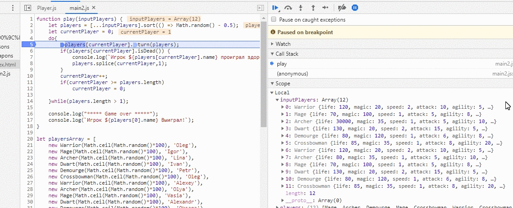

3) Добавить переменную в область Watches. Таким образом мы улучшаем атаку оружия для уже улучшенного лучника.

*gif №10 - просмотр и изменение переменной с помощью watches*
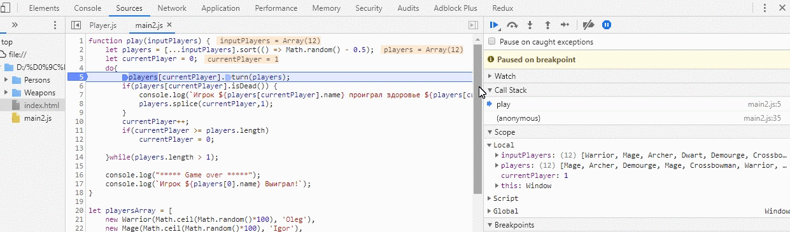

4) Воспользоваться консолью. Консоль предоставляет очень много возможностей. В ней можно выполнять различные вычисления, а так же выводить или изменять необходимые значения. На следующем gif продемонстрирован вывод всех игроков, после которого 3 первых удаляются. Затем выводится игрок на позиции 2, у которого меняется имя с `Vasia` на `Igor`. А затем, после очистки консоли, несколько раз получаем удачу и затем выбираем противника.

*gif №11 - действия с консолью*
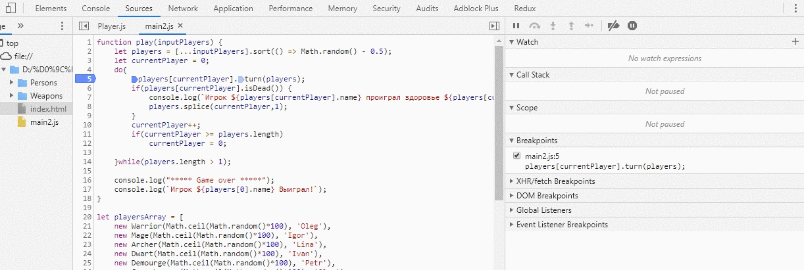

# Watch - область просмотра значений
**Chrome DevTools** позволяет вам легко увидеть несколько переменных в вашем приложении. Панель Watch предоставляет возможность просмотра переменных в вашем приложении. Она находится в разделе просмотра боковой панели отладчика.

*изображение №2*

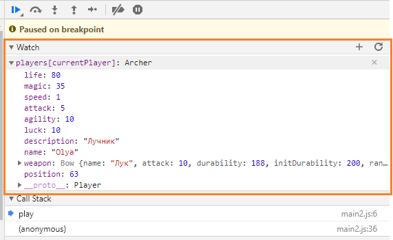

Чтобы добавить переменную в список просматриваемых, используйте значок добавления справа от заголовка раздела. Это откроет встроенный ввод, где вы предоставите имя переменной для просмотра. Как только он будет заполнен, нажмите клавишу enter, чтобы добавить его в список.

Значения переменных могут изменяться, поскольку приложение продолжает работать. Наблюдаемый список не является отображением переменных в реальном времени, если вы не выполняете пошаговое выполнение. Когда вы выполняете пошаговое выполнение с использованием точек останова, наблюдаемые значения обновляются автоматически. Чтобы вручную проверить переменные в списке - нажмите кнопку обновления справа от заголовка раздела.

Чтобы сохранить то, что вы ищете на минимальном уровне для более быстрой работы, вам может потребоваться удалить переменные из списка наблюдения. Это можно сделать, наведя указатель мыши на переменную, а затем щелкнув значок удаления, который отображается справа.

*gif №12 - просмотр значений в watch*
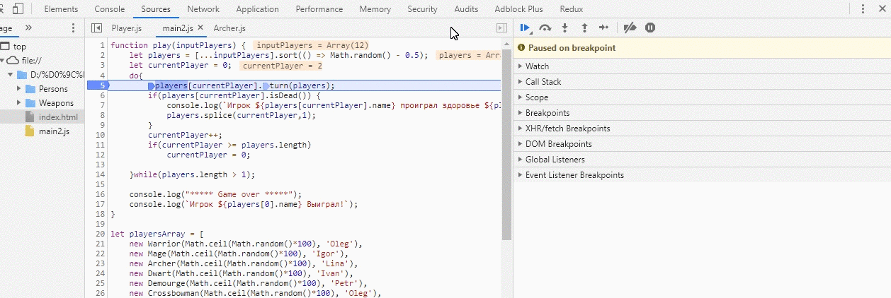

# Call Stack - стек вызова

Рядом с верхней частью боковой панели находится раздел Call Stack. Когда код ставится на паузу в точке останова, стек вызовов показывает путь выполнения в обратном хронологическом порядке, который привел код к этой точке останова. Это полезно для понимания не только того, где сейчас находится выполнение, но и как оно туда попало, что является важным фактором при отладке. Значок синей стрелки показывает, какая функция DevTools выделяет в данный момент.

*gif №13 - просмотр выполнения из call stack*
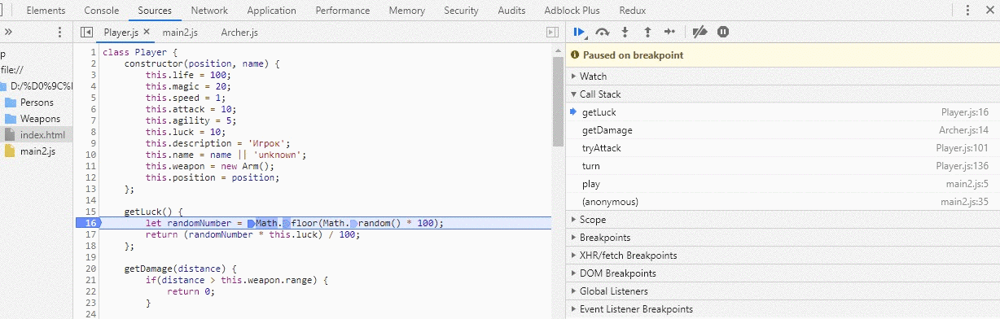

# Scope - область видимости

Когда вы приостанавливаете сценарий, на панели «Scope» отображаются все локальные и глобальные переменные в данный момент времени. Дважды щелкните на значении переменной, чтобы изменить его.

Панель «Scope» заполняется только тогда, когда сценарий приостановлен. Пока ваша страница запущена, панель Scope пуста. На панели отображаются свойства, определенные на локальном, закрытом и глобальном уровнях.

Панель «Scope» схожа с панелю «Watch». Отличием является то, что в эту панель не нужно добавлять никаких отслеживаемых значений. Она показывает все локальные значения.

*изображение 3 - панель scope*
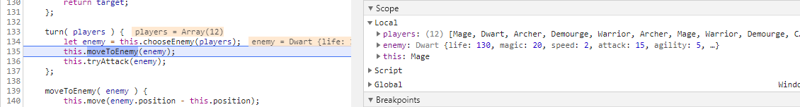

# Breakpoints - точки останова
Весь процесс отладки основан на остановке выполнения кода, выполнении кода по шагам и просмотре значения переменных при выполнении. Поэтому установка точек останова является начальным действием при отладке. 

Все точки останова можно посмотреть в блоке `Breakpoints`. Там же можно посмотреть где они находятся, а так же можно отключать их по отдельности.

На самой точке останова можно увидеть, в каком файле она находится, на какой строке, а так же саму строку кода. Слева есть чекбокс, по клику на который можно временно отключить данную точку останова.

*gif №14 - просмотр и деактивация точек останова*
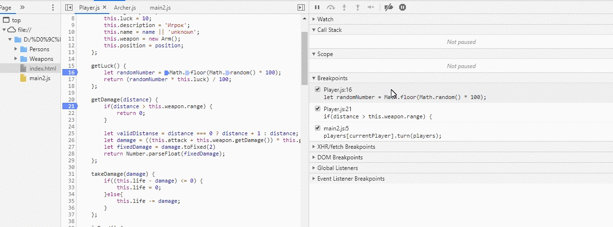

Так же можно делать условия для остановки выполнения кода в указанном месте. Для этого нужно нажать правой кнопкой мыши на точке останова, затем *edit breakpoint* и после этого ввести условие для остановки выполнения.
Обратите внимание, что на gif снизу выполнение сначала останавливалось всегда, а после редактирования стало останавливаться только тогда, когда у персонажа количество жизней стало равно 0.

*gif №15 - изменение условия остановки*
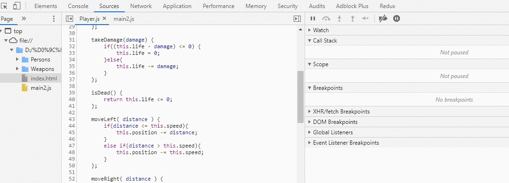

# Просмотр HTML элементов в браузере
Так как JavaScript разрабатывался для написания клиентской логики и работы на веб-странице, то и отладка JavaScript во взаимодействии с HTML страницей тоже присутствует и в переменных можно сразу видеть, какие элементы находятся в переменной

*gif №16 - работа с веб-страницей* 

