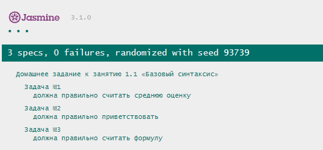

# Домашнее задание к лекции 1. «Основные понятия»

## Задача № 1

Требуется написать программу для решения квадратных уравнений (ax^2+bx+c = 0 ).

### Процесс реализации:
1. Активируйте [строгий режим](https://learn.javascript.ru/strict-mode) c помощью строки `"use strict";`

2. Реализуйте функцию `solveEquation()`, которая принимает 3 аргумента: `a`, `b`, `c` - коэффициенты квадратного уравнения.

3. Вычислите дискриминант по формуле `b^2-4*a*c`. Для возведения в степень используйте оператор - `**` или функцию `Math.pow()`.

4. Результатом функции должен быть **массив**.

5. Если дискриминант меньше нуля, то корней нет (пустой массив).

6. Если дискриминант равен нулю, то корень один. Его необходимо вычислить и вернуть из функции (массив с одним корнем). Формула для вычисления корня: `-b/(2*a)`

7. Если дискриминант больше нуля, то существует 2 решения уравнения. Их необходимо вычислить и вернуть из функции (массив с двумя корнями): `(-b + Math.sqrt(d) )/(2*a)` и `(-b - Math.sqrt(d) )/(2*a)`.

## Задача № 2

> Задача со "звездочкой", ее выполнение не влияет на получение допуска до дипломной работы, но принесет много полезного опыта.

Банку “Капитал Кэпиталс” потребовалось написать калькулятор для расчета выплат по ипотеке, и они решили поручить эту задачу вам. 

Напишите функцию, которая будет принимать процентную ставку, сумму первоначального взноса, сумму кредита и срок (дату окончания кредита) в качестве аргументов и выдавать сумму, которую в итоге заплатит клиент (первоначальный взнос, погашение основного долга, проценты за пользование кредитом). 

Не забывайте, что вы должны работать с числами: если параметр функции будет строкой, то попытайтесь преобразовать в число. Во всех остальных случаях возвращайте строку: `“Параметр <название параметра> содержит неправильное значение <значение параметра>”`.

Обратите внимание, что в инпуте пользователь указывает конечную дату, поэтому в функции необходимо посчитать срок в месяцах на основе введенной даты. (вам потребуется использовать встроенный объект Date)

### Процесс реализации:
1. Активируйте строгий режим соответствия.
2. Проконтролируйте корректность введенных данных.
3. Посчитайте тело кредита: сумма, которую необходимо вернуть банку (сумма кредита минус первоначальный взнос).
4. Посчитайте на какой срок был выдан кредит (в месяцах).
5. Ежемесячная оплата рассчитывается по формуле: `Платеж = S * (P + (P / (((1 + P)^n) - 1)))`, где:
`S` - тело кредита, `P` - 1/12 процентной ставки (от 0 до 1), `n` - количество месяцев
`^` - возведение в степень
6. Посчитайте общую сумму, которую придется заплатить клиенту.
7. Округлите результат до двух значений после запятой.
8. Выведите результат в консоль, а также верните его из функции. Результатом функции должно быть значение числового типа.

Примеры результатов:

Ввод: процент * 100, начальный взнос, сумма кредита, срок в месяцах

Ввод: 10, 0, 50000, 12. Вывод: 52749.53

Ввод: 10, 1000, 50000, 12. Вывод: 51694.54

Ввод: 10, 0, 20000, 24. Вывод: 22149.56

Ввод: 10, 1000, 20000, 24. Вывод: 21042.09

Ввод: 10, 20000, 20000, 24. Вывод: 0

Ввод: 10, 0, 10000, 36. Вывод: 11616.19 

Ввод: 15, 0, 10000, 36. Вывод: 12479.52

**ВАЖНО**
В п.п.5 `P` - процентная ставка должна быть дробным числом, следовательно, входные данные нужно разделить на 100.

## Требования для выполнения домашней работы

* браузер;
* редактор кода, например [Sublime][1] или [Visual Studio Code][2];
* аккаунт на [GitHub][0] ([инструкция по регистрации на GitHub][3]);
* система контроля версий [Git][4], установленная локально ([инструкция по установке Git][5]);
* запуск всех тестов должен успешно выполнять все тесты:

## Решение задач
**1.** Перейдите в папку задания `cd ./1.basic-concepts`.  
**2.** Откройте файл `task.js` в вашем редакторе кода и выполните задание.  
**3.** Самостоятельно вызывать функции не требуется, если это не требуется по заданию.  
**4.** Откройте файл `index.html` в вашем браузере и с помощью консоли `DevTools` убедитесь в правильности выводимых результатов.  
**5.** Откройте файл `test-runer.html` в вашем браузере и убедитесь, что все тесты выполняются (на вкладке `Spec List` можно видеть какие тесты выполнились, а какие нет).  
**6.** Добавьте файл `task.js` в индекс `git` с помощью команды `git add %file-path%`, где `%file-path%` - путь до целевого файла `git add task.js`.  
**7.** Сделайте коммит, используя команду `git commit -m '%comment%'`, где `%comment%` - это произвольный комментарий к вашему коммиту `git commit -m 'first commit variables'`.  
**8.** Опубликуйте код в репозиторий `homeworks` с помощью команды `git push -u origin main`. 
**9**. Пришлите ссылку на репозиторий через личный кабинет на сайте [Нетологии][6]. 

[0]: https://github.com/
[1]: https://www.sublimetext.com/
[2]: https://code.visualstudio.com/
[3]: https://github.com/netology-code/guides/tree/master/github
[4]: https://git-scm.com/
[5]: https://github.com/netology-code/guides/blob/master/git/README.md
[6]: https://netology.ru/

**_Никаких файлов прикреплять не нужно._**

Все задачи обязательны к выполнению для получения зачета, кроме задач со звездочкой. Присылать на проверку можно каждую задачу по отдельности или все задачи вместе. Во время проверки по частям ваша домашняя работа будет со статусом "На доработке".

Любые вопросы по решению задач задавайте в чате учебной группы.

