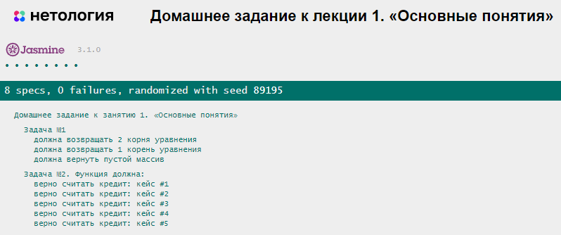

# Домашнее задание к лекции 1 «Основные понятия»

Перед выполнением заданий ознакомьтесь с блоком [перед началом работы над проектом](../README.md#перед-началом-работы-над-проектом). Выполните форк репозитория, разверните его с помощью Github pages и выполните задание [Работа с отладкой в браузере](../0.debugger/README.md).
## Задача 1

Написать программу для решения квадратных уравнений (ax² + bx + c = 0).

### Процесс реализации
1. Активируйте [строгий режим](https://learn.javascript.ru/strict-mode) c помощью строки `"use strict";`.
2. Реализуйте функцию `solveEquation`, которая принимает три аргумента: `a`, `b`, `c` — коэффициенты квадратного уравнения.
3. Вычислите дискриминант по формуле `b²-4*a*c`. Для возведения в степень используйте оператор — `**` или функцию [Math.pow](https://developer.mozilla.org/ru/docs/Web/JavaScript/Reference/Global_Objects/Math/pow).
4. Результатом функции должен быть **массив**.
5. Если дискриминант меньше нуля, то корней нет (пустой массив).
6. Если дискриминант равен нулю, то корень один. Его нужно вычислить и вернуть из функции (массив с одним корнем). Формула для вычисления корня: `-b/(2*a)`.
7. Если дискриминант больше нуля, то существует два решения уравнения. Их нужно вычислить и вернуть из функции — массив с двумя корнями: `(-b + Math.sqrt(d) )/(2*a)` и `(-b - Math.sqrt(d) )/(2*a)`.

## Задача 2

Банку «Капитал Кэпиталс» нужно написать калькулятор для расчёта выплат по ипотеке, и они решили поручить эту задачу вам. 

Напишите функцию, которая будет принимать процентную ставку, сумму первоначального взноса, сумму кредита и срок (длительность кредита в месяцах) в качестве аргументов и выдавать сумму, которую в итоге заплатит клиент (первоначальный взнос, погашение основного долга, проценты за пользование кредитом). 

Вы должны работать с числами: если параметр функции будет строкой, то попытайтесь преобразовать в число. Во всех остальных случаях возвращайте `false`.

### Что нужно сделать
1. Реализуйте функцию `calculateTotalMortgage`, которая принимает четыре аргумента: `percent`, `contribution`, `amount` и `countMonths`.
2. Преобразуйте процентную ставку из диапазона от 0 до 100 в диапазон от 0 до 1 и из годовой ставки — в месячную.
3. Посчитайте тело кредита — сумму, которую нужно вернуть банку (сумма кредита минус первоначальный взнос).
4. Ежемесячная оплата рассчитывается по формуле: `Платёж = S * (P + (P / (((1 + P)^n) - 1)))`, где:
`S` — тело кредита, `P` — 1/12 процентной ставки (от 0 до 1), `n` — количество месяцев, `^` — возведение в степень. Для возведения в степень используйте оператор — `**` или функцию [Math.pow](https://developer.mozilla.org/ru/docs/Web/JavaScript/Reference/Global_Objects/Math/pow).
5. Посчитайте общую сумму, которую придётся заплатить клиенту.
6. Округлите результат до двух значений после запятой. Результат округления должен быть **числом**.
7. Верните результат из функции. Результатом функции должно быть значение числового типа.

##### Примеры результатов

Ввод: процент (в диапазоне от 0 до 100), начальный взнос, сумма кредита, срок в месяцах

* Ввод: 10, 0, 50000, 12. Вывод: 52749.53
* Ввод: 10, 1000, 50000, 12. Вывод: 51694.54
* Ввод: 10, 0, 20000, 24. Вывод: 22149.56
* Ввод: 10, 1000, 20000, 24. Вывод: 21042.09
* Ввод: 10, 20000, 20000, 24. Вывод: 0
* Ввод: 10, 0, 10000, 36. Вывод: 11616.19
* Ввод: 15, 0, 10000, 36. Вывод: 12479.52

## Результат при правильном решении задания

## Требования по выполнению домашней работы

1. Все тесты успешно выполняются.
2. Соблюдается [кодстайл](https://github.com/netology-code/codestyle/tree/master/js#%D0%BF%D1%80%D0%B0%D0%B2%D0%B8%D0%BB%D0%B0-%D0%BE%D1%84%D0%BE%D1%80%D0%BC%D0%BB%D0%B5%D0%BD%D0%B8%D1%8F-javascript-%D0%BA%D0%BE%D0%B4%D0%B0).
3. Решение загружено в форкнутый репозиторий GitHub.
4. Решение опубликовано в GitHub Pages.

## Решение задач
1. Откройте файл `task.js` в вашем редакторе кода и выполните задание.  
2. Проверьте соблюдение [кодстайла](https://github.com/netology-code/codestyle/tree/master/js#%D0%BF%D1%80%D0%B0%D0%B2%D0%B8%D0%BB%D0%B0-%D0%BE%D1%84%D0%BE%D1%80%D0%BC%D0%BB%D0%B5%D0%BD%D0%B8%D1%8F-javascript-%D0%BA%D0%BE%D0%B4%D0%B0). Форматируйте ваш код через форматтер https://codebeautify.org/jsviewer.
3. Вы можете написать функцию `testCase` для проверки вашей работы.  
4. Добавьте файл `task.js` в индекс `git` с помощью команды `git add %file-path%`, где `%file-path%` — путь до целевого файла `git add ./1.base-concepts/task.js`.  
5. Сделайте коммит, используя команду `git commit -m '%comment%'`, где `%comment%`, — это произвольный комментарий к вашему коммиту `git commit -m 'Первое задание полностью готово'`.  
6. Опубликуйте код в репозиторий `homeworks` с помощью команды `git push -u origin main`. 
7. На проверку пришлите 2 ссылки. На файл с решением (`task.js`) и на страницу GitHub Pages — страницу с автотестами: `https://%USERNAME%.github.io/bjs-2-homeworks/1.base-concepts`.

**_Никакие файлы прикреплять не нужно._**

Все задачи обязательны к выполнению для получения зачёта. Можете прислать на проверку как каждую задачу по отдельности, так и все задачи вместе. Во время проверки по частям у вашей домашней работы будет статус «На доработке».

Любые вопросы по решению задач задавайте в чате учебной группы.
