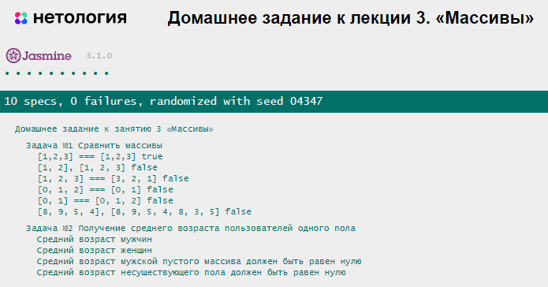

# Домашнее задание к лекции 3 «Массивы»

### Задача 1. Сравнить массивы

Создайте функцию `compareArrays(arr1, arr2)`, которая с помощью функции высшего порядка будет сравнивать значения двух массивов. Если массивы имеют одинаковые значения на одинаковых индексах, `compareArrays` должна выдавать `true` (иначе `false`). Используйте метод `every` для сравнения элементов одного массива с соответствующими элементами другого массива.

Пример вызова:

```javascript
compareArrays([8, 9], [6]) // false, разные значения
compareArrays([8, 9, 5, 4], [8, 9, 5, 4, 8, 3, 5]) // false, разные значения
compareArrays([9, 2, 4, 8, 2], [9, 2, 4]) // false, разные значения
compareArrays([1, 2, 3], [2, 3, 1]) // false, разные индексы, хотя и одинаковые значения
compareArrays([8, 1, 2], [8, 1, 2]) // true
```

### Задача 2. Фильтрация и преобразование массива

Создайте функцию `getUsersNamesInAgeRange(users, gender)`, которая возвращает среднее значение возраста пользователей одного пола.

1. Используйте метод `filter` для получения нужных пользователей.
2. Используйте метод `map` для получения их возрастов, или сразу формируйте среднее значение в `reduce`.
3. Используйте метод `reduce` для формирования среднего значения возраста.

```js
let result = arr.filter(...).map(...).reduce(...)
```

Пример вызова:

```javascript
const people = [
  {firstName: "Александр", secondName: "Карпов", age: 17, gender: "мужской"},
  {firstName: "Егор", secondName: "Морозов", age: 21, gender: "мужской"},
  {firstName: "Мелисса", secondName: "Леонова", age: 40, gender: "женский"},
  {firstName: "Мелания", secondName: "Савельева", age: 37, gender: "женский"},
  {firstName: "Мария", secondName: "Овчинникова", age: 18, gender: "женский"},
  {firstName: "Марьяна", secondName: "Котова", age: 17, gender: "женский"},
  {firstName: "Фёдор", secondName: "Селезнев", age: 50, gender: "мужской"},
  {firstName: "Георгий", secondName: "Петров", age: 35, gender: "мужской"},
  {firstName: "Даниил", secondName: "Андреев", age: 49, gender: "мужской"},
  {firstName: "Дарья", secondName: "Савельева", age: 25, gender: "женский"},
  {firstName: "Михаил", secondName: "Шаров", age: 22, gender: "мужской"},
  {firstName: "Владислав", secondName: "Давыдов", age: 40, gender: "мужской"},
  {firstName: "Илья", secondName: "Казаков", age: 35, gender: "мужской"},
  {firstName: "Евгений", secondName: "Кузьмин", age: 19, gender: "мужской"},
]
console.log(getUsersNamesInAgeRange(people, "мужской")); // 32
console.log(getUsersNamesInAgeRange(people, "женский")); // 27.4
console.log(getUsersNamesInAgeRange([], "женский")); // 0
console.log(getUsersNamesInAgeRange(people, "инопланетянин")); // 0
```

## Результат при правильном решении задания


## Требования к выполнению домашней работы

1.  Все тесты успешно выполняются.
2.  Соблюдается [кодстайл](https://github.com/netology-code/codestyle/tree/master/js#%D0%BF%D1%80%D0%B0%D0%B2%D0%B8%D0%BB%D0%B0-%D0%BE%D1%84%D0%BE%D1%80%D0%BC%D0%BB%D0%B5%D0%BD%D0%B8%D1%8F-javascript-%D0%BA%D0%BE%D0%B4%D0%B0).
3.  Решение загружено в форкнутый репозиторий GitHub.
4.  Решение опубликовано в GitHub Pages.

## Решение задач
1. Откройте файл `task.js` в вашем редакторе кода и выполните задание. <br>
2. Проверьте соблюдение [кодстайла](https://github.com/netology-code/codestyle/tree/master/js#%D0%BF%D1%80%D0%B0%D0%B2%D0%B8%D0%BB%D0%B0-%D0%BE%D1%84%D0%BE%D1%80%D0%BC%D0%BB%D0%B5%D0%BD%D0%B8%D1%8F-javascript-%D0%BA%D0%BE%D0%B4%D0%B0). Форматируйте ваш код через форматтер https://codebeautify.org/jsviewer.
3. Вы можете написать функцию `testCase` для проверки вашей работы. <br>
4. Добавьте файл `task.js` в индекс `git` с помощью команды `git add %file-path%`, где `%file-path%` — путь до целевого файла `git add ./3.arrays/task.js`. <br>
5. Сделайте коммит, используя команду `git commit -m '%comment%'`, где `%comment%` — это произвольный комментарий к вашему коммиту `git commit -m 'Третье задание полностью готово'`. <br>
6. Опубликуйте код в репозиторий `homeworks` с помощью команды `git push -u origin main`.<br>
7. На проверку пришлите 2 ссылки. На файл с решением (`task.js`) и на страницу GitHub Pages — страницу с автотестами: `https://%USERNAME%.github.io/bjs-2-homeworks/3.arrays`.

**_Никакие файлы прикреплять не нужно._**

Все задачи обязательны к выполнению для получения зачёта. Можете прислать на проверку как каждую задачу по отдельности, так и все задачи вместе. Во время проверки по частям у вашей домашней работы будет статус «На доработке».

Любые вопросы по решению задач задавайте в чате учебной группы.