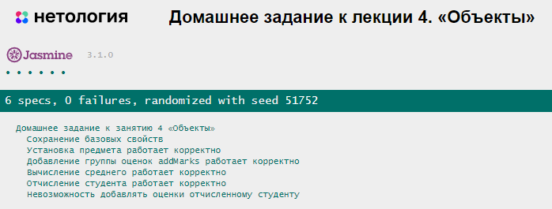

# Домашнее задание к лекции 4 «Объекты»

### Задача 1. Инкапсуляция студента
Мы хотим инкапсулировать логику работы со студентами в объекты так, чтобы могли создавать студентов, устанавливать им предмет, добавлять оценки, считать средний балл и отчислять.

##### Что нужно сделать

1. Создайте функцию-конструктор `Student(name, gender, age)` и с помощью оператора `new` несколько экземпляров объектов (студентов). Все аргументы функции-конструктора сохраните в соответствующие свойства и добавьте свойство `marks` со значением пустого массива. Позже в этот массив будут добавляться оценки.

2. Создайте доступный для всех экземпляров `student` метод `setSubject(subjectName)`, который при вызове будет устанавливать поле предмет `subject` экземпляра в `subjectName`. Для этого добавьте в свойство `Student.prototype` функции-конструктора функцию `setSubject`.
```js
Student.prototype.setSubject = function (subjectName) {
  //ваш код
}
```

3. Создайте метод `addMarks(...marksToAdd)` по аналогии с п. 2, который при вызове будет добавлять студенту сразу несколько оценок. Перед добавлением оценок добавьте проверку существования свойства `marks`, в котором хранятся оценки. Если пользователь отчислен, то у него не будет массива оценок, а, значит, и добавление будет невозможным.

 **Подсказка**: так как количество добавляемых оценок неизвестно, используйте rest-параметр.

4. Создайте метод `getAverage()` по аналогии с п. 2, который при вызове будет возвращать среднее арифметическое оценок студента. Добавьте проверку наличия оценок у студента. Если свойства `marks` не существует или оно пустое, сразу возвращайте ноль.

5. Создайте метод `exclude(reason)` по аналогии с п. 2, который при вызове будет исключать студента из учебного процесса и устанавливать причину исключения. Для этого надо удалить свойства `subject` и `marks` и добавить свойство `excluded` со значением `reason`.

### Пример:
```js
let student1 = new Student("Василиса", "женский", 19);
student1.setSubject("Algebra");
console.log(student1.getAverage()); // 0
student1.addMarks(4, 5, 4, 5);
console.log(student1.getAverage()); // 4.5
console.log(student1);
// {age: 19, gender: "женский", marks: [4, 5, 4, 5], name: "Василиса", subject: "Algebra"}
let student2 = new Student("Артём", "мужской", 25);
student2.setSubject("Geometry");
student2.exclude('плохая учёба')
console.log(student2)
// {name: "Артём", gender: "мужской", age: 25, excluded: "плохая учёба"}
```

## Результат при правильном решении задания


## Требования к выполнению домашней работы

1. Все тесты успешно выполняются.
2. Соблюдается [кодстайл](https://github.com/netology-code/codestyle/tree/master/js#%D0%BF%D1%80%D0%B0%D0%B2%D0%B8%D0%BB%D0%B0-%D0%BE%D1%84%D0%BE%D1%80%D0%BC%D0%BB%D0%B5%D0%BD%D0%B8%D1%8F-javascript-%D0%BA%D0%BE%D0%B4%D0%B0).
3. Решение загружено в форкнутый репозиторий GitHub.
4. Решение опубликовано в GitHub Pages.

## Решение задач
1. Откройте файл `task.js` в вашем редакторе кода и выполните задание. <br>
2. Проверьте соблюдение [кодстайла](https://github.com/netology-code/codestyle/tree/master/js#%D0%BF%D1%80%D0%B0%D0%B2%D0%B8%D0%BB%D0%B0-%D0%BE%D1%84%D0%BE%D1%80%D0%BC%D0%BB%D0%B5%D0%BD%D0%B8%D1%8F-javascript-%D0%BA%D0%BE%D0%B4%D0%B0). Форматируйте ваш код через форматтер https://codebeautify.org/jsviewer.
3. Добавьте файл `task.js` в индекс `git` с помощью команды `git add %file-path%`, где `%file-path%` — путь до целевого файла `git add ./4.objects/task.js`. <br>
4. Сделайте коммит, используя команду `git commit -m '%comment%'`, где `%comment%` — это произвольный комментарий к вашему коммиту `git commit -m 'Четвёртое задание полностью готово'`. <br>
5. Опубликуйте код в репозиторий `homeworks` с помощью команды `git push -u origin main`.<br>
6. На проверку пришлите 2 ссылки. На файл с решением (`task.js`) и на страницу GitHub Pages — страницу с автотестами: `https://%USERNAME%.github.io/bjs-2-homeworks/4.objects`.

**_Никакие файлы прикреплять не нужно._**

Все задачи обязательны к выполнению для получения зачета. Присылать на проверку можно каждую задачу по отдельности или все задачи вместе. Во время проверки по частям ваша домашняя работа будет со статусом "На доработке".

Любые вопросы по решению задач задавайте в чате учебной группы.
