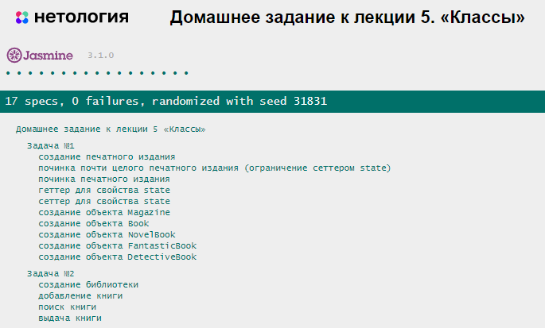

# Домашнее задание к лекции 5 «Классы»

## Задача 1. Печатное издание

Задача продолжает идеи, заложенные в предыдущем ДЗ, но уже с использованием всех возможностей классов. 

Нужно помочь перевести небольшую районную библиотеку в современный цифровой формат. Начнём с реализации нескольких классов: 

- классы печатных изданий — книг, журналов;
- класс библиотеки, который позволит работать с печатными изданиями: хранить их, выдавать читателям, принимать обратно.

### Что нужно сделать

Печатные издания бывают разных видов, но между всеми книгами, сборниками и журналами есть много общего: у всех них есть название, год издания, страницы, они могут повреждаться с процессе использования.

1. Создайте базовый класс `PrintEditionItem` со свойствами:

   - `name`;
   - `releaseDate`;
   - `pagesCount`;
   - `state`;
   - `type`.

 Конструктор класса должен принимать название (`name`), дату выпуска (`releaseDate`) и количество страниц (`pagesCount`) в качестве аргумента. Состояние (`state`) по умолчанию должно быть `100`, тип `type` пока должен быть равен `null`.

2. Испорченное издание можно подклеить и улучшить его состояние. Создайте метод `fix()`, увеличивающий `state` в полтора раза. Метод не должен принимать аргументы.

3. Нельзя улучшить новое издание, также бесполезно подклеивать полностью уничтоженное. Чтобы лучше контролировать состояние книг, создайте «сеттер» для свойства `state`, принимающий в качестве аргумента новое состояние печатного издания (число).

   Если новое состояние меньше `0`, «сеттер» должен записать в свойство `state` значение `0`. Если новое состояние больше `100`, должно быть записано значение `100`. В остальных случаях в свойство `state` должно быть записано переданное в «сеттер» значение.

4. Создайте «геттер», который позволит читать значение свойства `state`.

 **Пример использования**

 ```js
const sherlock = new PrintEditionItem(
  "Полное собрание повестей и рассказов о Шерлоке Холмсе в одном томе",
  2019,
  1008
);

 console.log(sherlock.releaseDate); //2019
console.log(sherlock.state); //100
sherlock.fix();
console.log(sherlock.state); //100
```

5. Создайте класс `Magazine`, который будет наследоваться от класса `PrintEditionItem`. Конструктор класса должен принимать такие же параметры, как и класс-родитель. От базового печатного издания журнал отличается только указанным типом. Значение свойства `type` должно быть равно `"magazine"`.

6. Создайте класс `Book`, который наследуется от класса `PrintEditionItem`. Конструктор класса должен принимать такие же параметры, как и класс-родитель, и имя автора книги `author`. Значение свойства `type` должно быть равно `"book"`.

7. Создайте классы, которые наследуются от класса `Book`: `NovelBook` — для романов, `FantasticBook` — для фантастических произведений и `DetectiveBook` — для детективов. Значения свойства `type` должны быть равны `"novel"`, `"fantastic"` и `"detective"` соответственно.

**Пример использования**

```js
const picknick = new FantasticBook(
  "Аркадий и Борис Стругацкие",
  "Пикник на обочине",
  1972,
  168
);

console.log(picknick.author); //"Аркадий и Борис Стругацкие"
picknick.state = 10;
console.log(picknick.state); //10
picknick.fix();
console.log(picknick.state); //15
```

## Задача 2. Библиотека

Теперь с помощью классов можно описать все возможные печатные издания, которые бывают в библиотеке. Пришло время подготовить саму библиотеку к работе в цифровом режиме — реализовать возможность хранить книги, выдавать их читателям и принимать обратно.

### Что нужно сделать

1. Создайте класс `Library` со свойствами:

   - `name`;
   - `books`.

   Конструктор класса должен принимать название библиотеки `name` (строка). Значением свойства `books` должен быть пустой массив.

2. Реализуйте метод `addBook(book)`, который в качестве аргумента будет принимать объект — книгу или журнал. Метод должен добавлять книгу в хранилище `books`, только если состояние `state` книги больше `30`.

3. Создайте метод `findBookBy(type, value)`, который в качестве аргументов будет принимать ключ для проведения поиска (тип, автор, название, год выпуска и пр.) и искомое значение. Метод должен возвращать книгу в случае успеха и `null`, если запрошенная книга не была найдена.

4. Создайте метод `giveBookByName(bookName)`, который в качестве аргумента будет принимать название книги, запрошенной читателем. Если запрошенная книга найдена, метод должен удалять книгу из хранилища `books` и возвращать её. Если книга не была найдена, метод должен возвращать `null`.

 **Пример использования**

 ```js
const library = new Library("Библиотека имени Ленина");

 library.addBook(
  new DetectiveBook(
    "Артур Конан Дойл",
    "Полное собрание повестей и рассказов о Шерлоке Холмсе в одном томе",
    2019,
    1008
  )
);
library.addBook(
  new FantasticBook(
    "Аркадий и Борис Стругацкие",
    "Пикник на обочине",
    1972,
    168
  )
);
library.addBook(new NovelBook("Герберт Уэллс", "Машина времени", 1895, 138));
library.addBook(new Magazine("Мурзилка", 1924, 60));

 console.log(library.findBookBy("name", "Властелин колец")); //null
console.log(library.findBookBy("releaseDate", 1924).name); //"Мурзилка"

 console.log("Количество книг до выдачи: " + library.books.length); //Количество книг до выдачи: 4
library.giveBookByName("Машина времени");
console.log("Количество книг после выдачи: " + library.books.length); //Количество книг после выдачи: 3
```

5. Протестируйте корректность работы классов и методов, реализовав тестовый сценарий:
   - создайте библиотеку;
   - добавьте в библиотеку несколько печатных изданий разных типов;
   - найдите книгу, изданную в 1919 году, или создайте её при необходимости;
   - выдайте любую книгу;
   - повредите выданную книгу;
   - восстановите выданную книгу;
   - попытайтесь добавить восстановленную книгу обратно в библиотеку.

## Задача 3. Журнал успеваемости *

> Это задача со звёздочкой. Её выполнение не влияет на получение допуска к дипломной работе, но поможет усвоить пройденный материал. 

Мы продолжаем совершенствовать журнал успеваемости студентов. Нужно преобразовать код прошлого ДЗ к классам. Реализуйте возможности:

1. В конструкторе класса сохраняйте имя пользователя и создавайте свойство для хранения оценок.
<details>
  <summary>В какой структуре хранить оценки по разным предметам?</summary>
    Удобней всего хранить оценки в виде объекта, где свойством будет название предмета, а значением свойства — массив оценок по этому предмету. Начальным значением будет пустой объект.

    {
      "физика": [4, 5, 5, 4],
      "химия": [3, 4],
      "литература": [4],
      "информатика": [5, 5, 5]
    }
</details>

2. Метод `addMark`, который будет добавлять оценку по предмету.

 * Валидируйте оценку. Она должна быть не меньше 2 и не больше 5. Если значение выходит за пределы этого диапазона, оценка не должна добавиться, и метод следует завершать.
 * Проверьте наличие предмета. Если предмет отсутствует в свойстве `marks`, то добавляйте новое свойство, названием которого будет название предмета, а значением — пустой массив.
  * Добавляйте в массив оценок по переданному свойству новый элемент, который был получен аргументом метода.
3. Метод `getAverageBySubject`, который будет возвращать среднюю оценку по одному предмету.
    * Проверьте наличие предмета среди оценок. Если предмет отсутствует, сразу возвращайте ноль.
    * С помощью `reduce` посчитайте сумму оценок по одному предмету.
    * Возвращайте результат деления суммы оценок на их количество.
4. Метод `getAverage`, который будет возвращать общую среднюю оценку по всем предметам.
    * Используйте метод `Object.keys` для получения всех названий предметов.
    * С помощью метода `reduce` или использования цикла перебирайте все предметы. Для каждого считайте среднюю оценку с помощью метода `getAverageBySubject` и суммируйте полученные значения.
    * Возвращайте результат деления суммы средних оценок на количество предметов.

Для решения задания нужно придумать структуру данных для хранения оценок по предметам. Это представляет наибольшую сложность. Работать должно, как в примере:

```js
class Student {
  // ваш код
}

const student = new Student("Олег Никифоров");
student.addMark(5, "химия");
student.addMark(5, "химия");
student.addMark(5, "физика");
student.addMark(4, "физика");
student.addMark(6, "физика"); // Оценка не добавится, так как больше 5
student.getAverageBySubject("физика"); // Средний балл по предмету физика 4.5
student.getAverageBySubject("биология"); // Вернёт 0, так как по такому предмету нет никаких оценок.
student.getAverage(); // Средний балл по всем предметам 4.75
```

### Критерии выполнения

- Реализованы все методы, в каждом из которых приведены примеры работы исключительных случаев: неверный формат оценки, несуществующий предмет и т. д.
- Возможно добавление оценки по любому предмету.

## Результат при правильном решении основного задания


## Результат при правильном выполнении дополнительного задания


## Требования к выполнению домашней работы

1. Все тесты успешно выполняются.
1. Соблюдается [кодстайл](https://github.com/netology-code/codestyle/tree/master/js#%D0%BF%D1%80%D0%B0%D0%B2%D0%B8%D0%BB%D0%B0-%D0%BE%D1%84%D0%BE%D1%80%D0%BC%D0%BB%D0%B5%D0%BD%D0%B8%D1%8F-javascript-%D0%BA%D0%BE%D0%B4%D0%B0).
1. Решение загружено в форкнутый репозиторий GitHub.
1. Решение опубликовано в GitHub Pages.

## Решение задач
1. Откройте файл `task.js` в вашем редакторе кода и выполните задание. <br>
2. Проверьте соблюдение [кодстайла](https://github.com/netology-code/codestyle/tree/master/js#%D0%BF%D1%80%D0%B0%D0%B2%D0%B8%D0%BB%D0%B0-%D0%BE%D1%84%D0%BE%D1%80%D0%BC%D0%BB%D0%B5%D0%BD%D0%B8%D1%8F-javascript-%D0%BA%D0%BE%D0%B4%D0%B0). Форматируйте ваш код через форматтер https://codebeautify.org/jsviewer.
3. Добавьте файл `task.js` в индекс `git` с помощью команды `git add %file-path%`, где `%file-path%` — путь до целевого файла `git add ./5.classes/task.js`. <br>
4. Сделайте коммит, используя команду `git commit -m '%comment%'`, где `%comment%` — это произвольный комментарий к вашему коммиту `git commit -m 'Пятое задание полностью готово'`. <br>
5. Опубликуйте код в репозиторий `homeworks` с помощью команды `git push -u origin main`.<br>
6. На проверку пришлите 2 ссылки. На файл с решением (`task.js`) и на страницу GitHub Pages — страницу с автотестами: `https://%USERNAME%.github.io/bjs-2-homeworks/5.classes`.

**_Никакие файлы прикреплять не нужно._**

Все задачи обязательны к выполнению для получения зачёта. Можете прислать на проверку как каждую задачу по отдельности, так и все задачи вместе. Во время проверки по частям у вашей домашней работы будет статус «На доработке».

Любые вопросы по решению задач задавайте в чате учебной группы.
