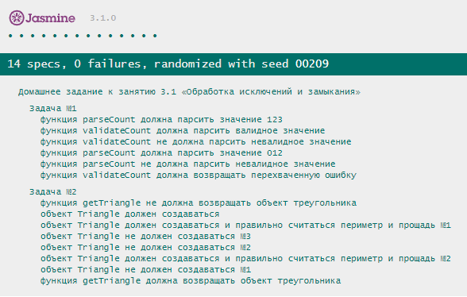

# Домашнее задание к лекции 6 «Обработка исключений и замыкания»

## Задача №1. Форматтер чисел
Ошибки случаются, такова жизнь. Но нужно уметь с ними работать. Ваши коллеги разработали форму, которая принимает от пользователя количество покупаемых единиц товара, вас же попросили написать функцию-преобразователь, которая возвращает число - если всё ок, и генерирует ошибку - если ввод не является числом в десятичной системе счисления.
Используйте возможности стандартной библиотеки JS для преобразования строки в число.

### Процесс реализации:
1. Напишите функцию `parseCount` 
    * Аргументом функции является значение, которое необходимо распарсить.
    * Для парсинга воспользуйтесь функцией `Number.parseInt`.
    * Если результатом парсинга является значение `NaN`, то выбрасывайте исключение с ошибкой *"Невалидное значение"*.
    * Верните результат парсинга из функции.

2. Напишите функцию `validateCount`
    * Аргументом функции является значение, которое необходимо распарсить.
    * Попробуйте распарсить значение с помощью функции `parseCount`.
    * Если распарсить удаётся успешно, то возвращайте результат.
    * Перехватывайте исключение, которое может выбрасывать функция `parseCount`.
    * Возвращайте ошибку из функции в случае перехвата исключения.

## Задача №2. Треугольник 
На этот раз Вася решил сделать онлайн калькулятор геометрических фигур. Помогите Васе сделать калькулятор треугольников, который сможет проверять существование треугольника, а так же считать площадь и периметр.

### Процесс реализации:
1. Напишите класс `Triangle`
    * Конструктор класса должен принимать 3 стороны треугольника.
    * В случае нарушения правила существования треугольника (сумма двух сторон меньше третьей) выбрасывайте исключение с ошибкой *"Треугольник с такими сторонами не существует"*.
    * Метод `getPerimeter` должен возвращать периметр треугольника.
    * Метод `getArea` должен возвращать площадь треугольника (для подсчёта площади воспользуйтесь [формулой Герона](https://ru.wikipedia.org/wiki/%D0%A4%D0%BE%D1%80%D0%BC%D1%83%D0%BB%D0%B0_%D0%93%D0%B5%D1%80%D0%BE%D0%BD%D0%B0)). Точность должна вычисляться с точностью до трёх знаков после запятой.
2. Напишите функцию `getTriangle`
    * Аргументами функции являются 3 значения длин сторон.
    * Попытайтесь вернуть новый объект треугольника.
    * В случае перехвата исключения возвращайте объект с двумя методами `getArea` и `getPerimeter`, которые возвращают строку: *"Ошибка! Треугольник не существует"*.

## Требования для выполнения домашней работы

* браузер;
* редактор кода, например [Sublime][1] или [Visual Studio Code][2];
* аккаунт на [GitHub][0] ([инструкция по регистрации на GitHub][3]);
* система контроля версий [Git][4], установленная локально ([инструкция по установке Git][5]).
* запуск всех тестов должен успешно выполнять все тесты:

## Решение задач

1. Произведите [Fork](https://ru.wikipedia.org/wiki/Форк) репозитория с задачами (fork необходимо делать перед выполнением каждой домашней работы).
2. Перейдите в папку задания `cd ./6.exception-closure`
3. Откройте файл `task.js` в вашем редакторе кода и выполните задание.
4. Самостоятельно вызывать функции не требуется, если это не требуется по заданию.
5. Откройте файл `index.html` в вашем браузере и с помощью консоли DevTools и убедитесь в правильности выводимых результатов.
6. Откройте файл `test-runer.html` в вашем браузере и убедитесь, что все тесты выполняются (на вкладке Spec List можно видеть какие тесты выполнились, а какие нет)
7. Добавьте файл `task.js` в индекс git с помощью команды `git add %file-path%`, где `%file-path%` - путь до целевого файла. `git add task.js`.
8. Сделайте коммит, используя команду `git commit -m '%comment%'`, где `%comment%` - это произвольный комментарий к вашему коммиту. `git commit -m 'first commit variables'`.
9. Опубликуйте код в репозиторий `homeworks` с помощью команды `git push -u origin main`.
10. Пришлите ссылку на репозиторий через личный кабинет на сайте [Нетологии][6].

[0]: https://github.com/
[1]: https://www.sublimetext.com/
[2]: https://code.visualstudio.com/
[3]: https://github.com/netology-code/guides/blob/master/git/github.md
[4]: https://git-scm.com/
[5]: https://github.com/netology-code/guides/blob/master/git/README.md
[6]: https://netology.ru/

*Никаких файлов прикреплять не нужно.*

Любые вопросы по решению задач задавайте в чате учебной группы.
