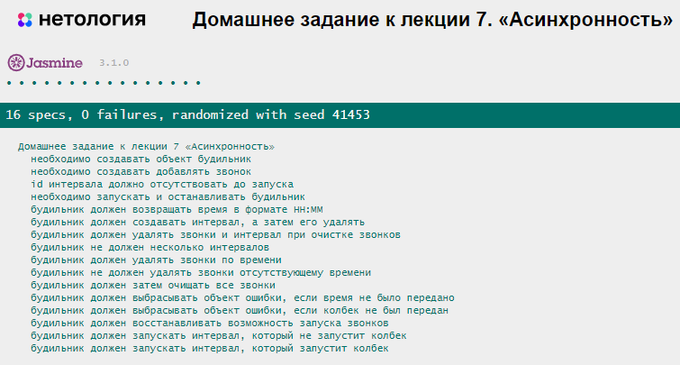

# Домашнее задание к лекции 7 «Асинхронность» 

## Задача 1. Будильник-колыбельная

Помогите Васе перестать просыпать на пары. 
Для этого нужно написать программу-будильник-колыбельную с возможностью добавления, удаления, запусков и остановки звонков.

## Что нужно сделать

Необходимо написать класс **AlarmClock** с методами:

1. `constructor` — выделяет память для объекта. 
  * Создайте свойство для хранения коллекции звонков `alarmCollection` с начальным значением пустого массива. 
  * Создайте свойство `intervalId` для хранения `id` таймера без начального значения.

2. `addClock` — добавляет новый звонок в коллекцию существующих. 
  * Принимает параметр времени в формате `HH:MM` — время, когда действие должно запуститься.
  * Принимает параметр функции-коллбека — действие, которое должно запуститься.
  * Проверьте, переданы ли параметры времени и коллбека. Если параметр не передан, выполните выброс ошибки с помощью `throw new Error('Отсутствуют обязательные аргументы')`.
  * Проверьте, есть ли звонок с таким же временем. Если есть, выведите предупреждение в консоль с помощью `console.warn('Уже присутствует звонок на это же время')`.
  * Перед завершением метода добавьте в массив звонков объект со свойствами `callback`, `time`, `canCall`. В свойстве `canCall` должно быть значение запуска функции коллбека. Изначально значением должно быть `true`.

3. `removeClock` — удаляет звонки по определённому времени.
  * Принимает `time` звонка, который следует удалить.
  * Удалите из массива звонков те, у которых `time` совпадает со значением аргумента. Например, можно использовать метод `filter`.

4. `getCurrentFormattedTime` — возвращает текущее время в строковом формате `HH:MM`.

5. `start` — запускает будильник.
  * Проверьте наличие значения в свойстве `intervalId`. Если в нём присутствует значение, то завершайте выполнение метода. Программа не должна позволять создавать несколько интервалов.
  * Создавайте новый интервал, в котором каждую секунду выполняйте действия:
     - Перебирайте все звонки с помощью метода `forEach`.
     - При переборе каждый звонок проверяйте на возможность его запуска: *свойство `time` совпадает с текущим временем, и звонок может выполняться (в свойстве `canCall` находится `true`)*.
    3. При истинном условии (необходимости запуска звонка) в свойство `canCall` (возможность вызова звонка) присваивайте `false` и вызывайте коллбек звонка (свойство `callback`).
  * Результат создания интервала сохраняйте в свойство `intervalId`.

6. `stop` — останавливает выполнение интервала будильника.
  * Вызовите функцию `clearInterval` для удаления интервала.
  * Сбросьте значение из свойства `intervalId`. Для сброса свойства можно присваивать `null`.

7. `resetAllCalls` — сбрасывает возможность запуска всех звонков.
  * С помощью метода `forEach` присваивайте `true` в свойство `canCall` у каждого звонка.

8. `clearAlarms` — удаляет все звонки.
  * Вызывает метод остановки интервала (метод `stop`).
  * Удаляет все звонки. Для удаления всех звонков переприсваивайте свойство `alarmCollection` в пустой массив.

## Результат при правильном решении задания

## Требования к выполнению домашней работы

1. Все тесты успешно выполняются.
2. Соблюдается [кодстайл](https://github.com/netology-code/codestyle/tree/master/js#%D0%BF%D1%80%D0%B0%D0%B2%D0%B8%D0%BB%D0%B0-%D0%BE%D1%84%D0%BE%D1%80%D0%BC%D0%BB%D0%B5%D0%BD%D0%B8%D1%8F-javascript-%D0%BA%D0%BE%D0%B4%D0%B0).
3. Решение загружено в форкнутый репозиторий GitHub.
4. Решение опубликовано в GitHub Pages.

## Решение задач
1. Откройте файл `task.js` в вашем редакторе кода и выполните задание.  
2. Проверьте соблюдение [кодстайла](https://github.com/netology-code/codestyle/tree/master/js#%D0%BF%D1%80%D0%B0%D0%B2%D0%B8%D0%BB%D0%B0-%D0%BE%D1%84%D0%BE%D1%80%D0%BC%D0%BB%D0%B5%D0%BD%D0%B8%D1%8F-javascript-%D0%BA%D0%BE%D0%B4%D0%B0). Форматируйте ваш код через форматтер https://codebeautify.org/jsviewer.
3. Добавьте файл `task.js` в индекс `git` с помощью команды `git add %file-path%`, где `%file-path%` — путь до целевого файла `git add ./7.async/task.js`.  
4. Сделайте коммит, используя команду `git commit -m '%comment%'`, где `%comment%` — это произвольный комментарий к вашему коммиту `git commit -m 'Седьмое задание полностью готово'`.  
5. Опубликуйте код в репозиторий `homeworks` с помощью команды `git push -u origin main`. 
6. На проверку пришлите 2 ссылки. На файл с решением (`task.js`) и на страницу GitHub Pages — страницу с автотестами: `https://%USERNAME%.github.io/bjs-2-homeworks/7.async`.

**_Никакие файлы прикреплять не нужно._**

Все задачи обязательны к выполнению для получения зачёта. Можете прислать на проверку как каждую задачу по отдельности, так и все задачи вместе. Во время проверки по частям у вашей домашней работы будет статус «На доработке».

Любые вопросы по решению задач задавайте в чате учебной группы.
