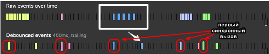

# Домашнее задание к лекции 8 «Декораторы»

### Задача 1. Усовершенствуйте кэширующий декоратор

Напишите усовершенствованный кэширующий декоратор `cachingDecoratorNew`, аналогичный рассмотренному на лекции, таким образом, чтобы он кэшировал только последние 5 **различных** вызовов функции. То есть чтобы кэш мог хранить только 5 значений.

Для того, чтобы тесты выполнялись функция должна возвращать следующие строки(!) "Вычисляем: 10" для первого вызова (10 для примера) и "Из кэша: 10" для повторного. Подробнее смотрите в файле (tests.js)[./tests.js].

Рекомендуется параллельно выводить результаты в консоль, чтобы вам было удобнее отлаживать.

```js
console.log("Вычисляем: " + result);
return "Вычисляем: " + result;
```

<details> 
  <summary>Подсказка 1</summary>
  Хэш (однозначное соответствие аргументы => строка) удобно реализовать `hash = args.join(',')`.

Кэш можно сделать массивом объектов. Например:

```js
cache = [
  { hash: "10,20,30", value: 60 },
  { hash: "2,2,2", value: 6 },
];
```

</details>

<details> 
  <summary>Подсказка 2</summary>
  
  Тогда при каждом запуске (внутри `wrapper`) нам следует проверять, есть ли `hash` для данных аргументов в кэше.
  
  Как это сделать? 
  Например методом find. `const objectInCache = cache.find((item) => тут нужно подумать)`
</details>

<details> 
  <summary>Подсказка 3</summary>
  Если элемента в кэше нет (!objectInCache), проще всего добавить новый объект в кэш и если объектов стало больше чем 5 удалить первый с начала.
  
  Как это сделать?
  Конечно методом shift() массива.

</details>

<details> 
  <summary>Подсказка 4</summary>
  Данный код мог бы служить базой для решения, но всё равно остаётся место для подумать:
  
  ```js
  function cachingDecoratorNew(func) {
  let cache = [];

  function wrapper(...args) {
      const hash = ???; // получаем правильный хэш
      let objectInCache = cache.find((item) => ???); // ищем элемент, хэш которого равен нашему хэшу
      if (!objectInCache) { // если элемент не найден
          console.log("Из кэша: " + ???); // индекс нам известен, по индексу в массиве лежит объект, как получить нужное значение?
          return "Из кэша: " + ???;
      }

      let result = func(...args); // в кэше результата нет - придётся считать
      cache.push(???) ; // добавляем элемент с правильной структурой
      if (cache.length > 5) { 
        ??? // если слишком много элементов в кэше надо удалить самый старый (первый) 
      }
      console.log("Вычисляем: " + result);
      return "Вычисляем: " + result;  
  }
  return wrapper;
}

  ```
  
</details>


#### Какого результата мы хотели бы достичь:

```javascript
const addThree = (a, b, c) => a + b + c;
const upgradedAddThree = cachingDecoratorNew(addThree);
upgradedAddThree(1, 2, 3); // вычисляем: 6
upgradedAddThree(1, 2, 3); // из кэша: 6
upgradedAddThree(2, 2, 3); // вычисляем: 7
upgradedAddThree(3, 2, 3); // вычисляем: 8
upgradedAddThree(4, 2, 3); // вычисляем: 9
upgradedAddThree(5, 2, 3); // вычисляем: 10
upgradedAddThree(6, 2, 3); // вычисляем: 11   (при этом кэш для 1, 2, 3 уничтожается)
upgradedAddThree(1, 2, 3); // вычисляем: 6  (снова вычисляем, кэша нет)
```

### Задача 2. Debounce декоратор с моментальным вызовом

Усовершенствуйте рассмотренный на лекции debounce декоратор таким образом, чтобы первый его вызов происходил моментально а следующий не раньше чем через интервал времени, причем интервал должен задаваться в момент применения декоратора к функции. Такие декораторы называются "Leading edge" или "immediate" (немедленный). Они применяется если события, например отправка информации, происходит слишком часто.
[Дополнительная статья про debouncing и throttling](https://techrocks.ru/2021/05/31/throttling-and-debouncing-explained/).



<details> 
  <summary>Подсказка 1</summary>
  Вызывайте переданную функцию немедленно и взводите флаг, который поясняет, что вызов функции является первым. При взедённом флаге, синхронный запуск функции не должен выполняться.
</details>

```javascript
const sendSignal = () => console.log("Сигнал отправлен");
const upgradedSendSignal = debounceDecoratorNew(sendSignal, 2000);
setTimeout(upgradedSendSignal); // Сигнал отправлен
setTimeout(upgradedSendSignal, 300); // проигнорировано так как от последнего вызова прошло менее 2000мс (300 - 0 < 2000)
setTimeout(upgradedSendSignal, 900); // проигнорировано так как времени от последнего вызова прошло: 900-300=600 (600 < 2000)
setTimeout(upgradedSendSignal, 1200); // проигнорировано так как времени от последнего вызова прошло: 1200-900=300 (300 < 2000)
setTimeout(upgradedSendSignal, 2300); // проигнорировано так как времени от последнего вызова прошло: 2300-1200=1100 (1100 < 2000)
setTimeout(upgradedSendSignal, 4400); // Сигнал отправлен так как времени от последнего вызова прошло: 4400-2300=2100 (2100 > 2000)
setTimeout(upgradedSendSignal, 4500); // Сигнал будет отправлен, так как последний вызов debounce декоратора (спустя 4500 + 2000 = 6500) 6,5с
```

### Задача 3. Усовершенствуйте debounceDecoratorNew

Представьте ситуацию, что пользователь очень часто нажимает отправить, при этом наш `debounce` декоратор отправляет сообщения не чаще чем раз в интервал времени, но мы хотим дополнительно знать, сколько всего раз была вызвана исходная функция.
Усовершенствуйте декоратор из задания 2 таким образом, чтобы в свойстве `count` декорированной функции хранилось количество вызовов. Для решения используйте подход, который был применен в лекции для декоратора-шпиона. Усовершенствованный декоратор должен называться `debounceDecorator2`.

<details> 
  <summary>Подсказка 1</summary>
  Добавьте к обертке wrapper новое свойство count в котором храните количество вызовов.
</details>


## Требования для выполнения домашней работы

- браузер;
- редактор кода, например [Sublime][1] или [Visual Studio Code][2];
- аккаунт на [GitHub][0] ([инструкция по регистрации на GitHub][3]);
- система контроля версий [Git][4], установленная локально ([инструкция по установке Git][5]).
- запуск всех тестов должен успешно выполнять все тесты:
  

## Решение задач

1. Произведите [Fork](https://ru.wikipedia.org/wiki/Форк) репозитория с задачами (fork необходимо делать перед выполнением каждой домашней работы).
2. Перейдите в папку задания. `cd ./8.decorators`.
3. Откройте файл `task.js` в вашем редакторе кода и выполните задание.
4. Самостоятельно вызывать функции не требуется, если это не требуется по заданию.
5. Откройте файл `index.html` в вашем браузере и с помощью консоли DevTools убедитесь в правильности выводимых результатов.
6. Откройте файл `test-runer.html` в вашем браузере и убедитесь, что все тесты выполняются (на вкладке Spec List можно видеть какие тесты выполнились, а какие нет).
7. Добавьте файл `task.js` в индекс git с помощью команды `git add %file-path%`, где `%file-path%` - путь до целевого файла. `git add task.js`.
8. Сделайте коммит, используя команду `git commit -m '%comment%'`, где `%comment%` - это произвольный комментарий к вашему коммиту. `git commit -m 'first commit variables'`.
9. Опубликуйте код в репозиторий `homeworks` с помощью команды `git push -u origin main`.
10. Пришлите ссылку на репозиторий через личный кабинет на сайте [Нетологии][6].

[0]: https://github.com/
[1]: https://www.sublimetext.com/
[2]: https://code.visualstudio.com/
[3]: https://github.com/netology-code/guides/blob/master/git/github.md
[4]: https://git-scm.com/
[5]: https://github.com/netology-code/guides/blob/master/git/README.md
[6]: https://netology.ru/

_Никаких файлов прикреплять не нужно._

Любые вопросы по решению задач задавайте в чате учебной группы.
