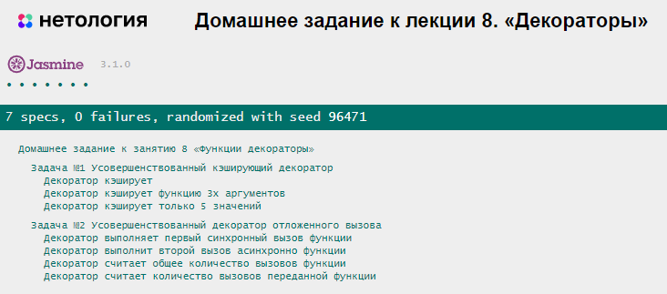

# Домашнее задание к лекции 8 «Декораторы»

### Задача 1. Усовершенствуйте кэширующий декоратор

Напишите усовершенствованный кэширующий декоратор `cachingDecoratorNew`, аналогичный рассмотренному на лекции, таким образом, чтобы он кэшировал только последние 5 **различных** вызовов функции. То есть чтобы кэш мог хранить только 5 значений.

Для того, чтобы тесты выполнялись функция должна возвращать следующие строки(!) "Вычисляем: 10" для первого вызова (10 для примера) и "Из кэша: 10" для повторного. Подробнее смотрите в файле (tests.js)[./tests.js].

Для вычисления хеша следует использовать алгоритм хеширования [MD5](https://ru.wikipedia.org/wiki/MD5). Для использования этого алгоритма, в файл с тестами была подключена библиотека [js-md5](https://github.com/emn178/js-md5). То есть этот алгоритм хеширования можно использовать в любой области видимости файлов скриптов, подлюченных к странице с тестми:

```js
const hasingText = "какой-нибудь текст";
console.log(md5(hasingText)); // 8d1d3ecc455a4220590e6d27e6c1a267
console.log(md5([10, 20, 30])); // 7f49b84d0bbc38e96493718013baace6
```

Рекомендуется параллельно выводить результаты в консоль, чтобы вам было удобнее отлаживать.

```js
console.log("Вычисляем: " + result);
return "Вычисляем: " + result;
```

<details> 
  <summary>Подсказка 1</summary>
  Хэш (однозначное соответствие аргументы => строка) удобно реализовать `hash = md5(args)`.

Кэш можно сделать массивом объектов. Например:

```js
cache = [
  { hash: "7f49b84d0bbc38e96493718013baace6", value: 60 },
  { hash: "36d9d8df7a0a21c339bf74e2a30d68bd", value: 6 },
  { hash: "fd526d0a3bfd3ebdc1fc0f998d241da6", value: 791 },
];
```

</details>

<details> 
  <summary>Подсказка 2</summary>
  
  Тогда при каждом запуске (внутри `wrapper`) нам следует проверять, есть ли `hash` для данных аргументов в кэше.
  
  Как это сделать? 
  Например методом find. `const objectInCache = cache.find((item) => тут нужно подумать)`
</details>

<details> 
  <summary>Подсказка 3</summary>
  Если элемента в кэше нет (!objectInCache), проще всего добавить новый объект в кэш и если объектов стало больше чем 5 удалить первый с начала.
  
  Как это сделать?
  Конечно методом shift() массива.

</details>

<details> 
  <summary>Подсказка 4</summary>
  Данный код мог бы служить базой для решения, но всё равно остаётся место для подумать:
  
  ```js
  function cachingDecoratorNew(func) {
  let cache = [];

  function wrapper(...args) {
      const hash = ???; // получаем правильный хэш c помощью функции md5
      let objectInCache = cache.find((item) => ???); // ищем элемент, хэш которого равен нашему хэшу
      if (objectInCache) { // если элемент найден
          console.log("Из кэша: " + ???); // индекс нам известен, по индексу в массиве лежит объект, как получить нужное значение?
          return "Из кэша: " + ???;
      }

      let result = func(...args); // в кэше результата нет - придётся считать
      cache.push(???) ; // добавляем элемент с правильной структурой
      if (cache.length > 5) { 
        ??? // если слишком много элементов в кэше надо удалить самый старый (первый) 
      }
      console.log("Вычисляем: " + result);
      return "Вычисляем: " + result;  
  }
  return wrapper;
}

  ```
  
</details>


#### Какого результата мы хотели бы достичь:

```javascript
const addAndMultiply = (a, b, c) => (a + b) * c;
const upgraded = cachingDecoratorNew(addAndMultiply);
upgraded(1, 2, 3); // вычисляем: 9
upgraded(1, 2, 3); // из кэша: 9
upgraded(2, 2, 3); // вычисляем: 12
upgraded(3, 2, 3); // вычисляем: 15
upgraded(4, 2, 3); // вычисляем: 18
upgraded(5, 2, 3); // вычисляем: 21
upgraded(6, 2, 3); // вычисляем: 18 (при этом кэш для 1, 2, 3 уничтожается)
upgraded(1, 2, 3); // вычисляем: 9  (снова вычисляем, кэша нет)
```

### Задача 2. Debounce декоратор с моментальным вызовом и подсчётом количества вызовов

Усовершенствуйте рассмотренный на лекции debounce декоратор добавив 3 дополнительные фичи
1. Первый вызов происходил моментально а следующий не раньше чем через интервал времени, причем интервал должен задаваться в момент применения декоратора к функции. [Дополнительная статья про debouncing и throttling](https://techrocks.ru/2021/05/31/throttling-and-debouncing-explained/).
2. Усовершенствуйте декоратор таким образом, чтобы в свойстве `count` декорированной функции хранилось количество вызовов декорированной функции. Для решения используйте подход, который был применен в лекции для декоратора-шпиона. 
3. Усовершенствуйте декоратор таким образом, чтобы в свойстве `allCount` декорированной функции хранилось количество вызовов декоратора. Для решения используйте подход, который был применен в лекции для декоратора-шпиона. 


<details> 
  <summary>Подсказка 1</summary>
  Для ориентира на первый запуск, можно опираться на идентификатор таймаута. При первом вызове, в идентификаторе ничего не будет.
</details>

<details> 
  <summary>Подсказка 2</summary>
  Добавьте к обертке wrapper новое свойства `count` и `allCount` в котором храните количество вызовов переданной функции и результата декоратора соответсвенно..
</details>

```javascript
const sendSignal = (signalOrder, delay) => console.log("Сигнал отправлен", signalOrder, delay);
const upgradedSendSignal = debounceDecoratorNew(sendSignal, 2000);
setTimeout(() => upgradedSendSignal(1, 0)); // Сигнал отправлен + будет запланирован асинхронный запуск, который будет проигнорирован так как следующий сигнал отменит предыдущий (300 - 0 < 2000)
setTimeout(() => upgradedSendSignal(2, 300), 300); // проигнорировано так как следующий сигнал отменит предыдущий (900 - 300 < 2000)
setTimeout(() => upgradedSendSignal(3, 900), 900); // проигнорировано так как следующий сигнал отменит предыдущий (1200 - 900 < 2000)
setTimeout(() => upgradedSendSignal(4, 1200), 1200); // проигнорировано так как следующий сигнал отменит предыдущий (2300 - 1200 < 2000)
setTimeout(() => upgradedSendSignal(5, 2300), 2300); // Сигнал отправлен так как следующий вызов не успеет отменить текущий: 4400-2300=2100 (2100 > 2000)
setTimeout(() => upgradedSendSignal(6, 4400), 4400); // проигнорировано так как следующий сигнал отменит предыдущий (4500 - 4400 < 2000)
setTimeout(() => upgradedSendSignal(7, 4500), 4500); // Сигнал будет отправлен, так как последний вызов debounce декоратора (спустя 4500 + 2000 = 6500) 6,5с
setTimeout(() => {
  console.log(upgradedSendSignal.count); // было выполнено 3 отправки сигнала
  console.log(upgradedSendSignal.allCount); // было выполнено 6 вызовов декорированной функции
}, 7000)
```


## Результат при правильной реалиации задания


## Требования для выполнения домашней работы

* Все тесты успешно выполняются.
* Соблюдается [кодстайл](https://github.com/netology-code/codestyle/tree/master/js#%D0%BF%D1%80%D0%B0%D0%B2%D0%B8%D0%BB%D0%B0-%D0%BE%D1%84%D0%BE%D1%80%D0%BC%D0%BB%D0%B5%D0%BD%D0%B8%D1%8F-javascript-%D0%BA%D0%BE%D0%B4%D0%B0).
* Решение загружено в форкнутый репозиторий гитхаб.
* Решение опубликовано в github-pages.

## Решение задач
**1.** Откройте файл `task.js` в вашем редакторе кода и выполните задание. <br>
**2.** Проверьте правильность соблюдения [кодстайла](https://github.com/netology-code/codestyle/tree/master/js#%D0%BF%D1%80%D0%B0%D0%B2%D0%B8%D0%BB%D0%B0-%D0%BE%D1%84%D0%BE%D1%80%D0%BC%D0%BB%D0%B5%D0%BD%D0%B8%D1%8F-javascript-%D0%BA%D0%BE%D0%B4%D0%B0).
**3.** Вы **можете** написать функцию `testCase` в которой проверять решение вашей работы. <br>
**4.** Откройте файл `test-runer.html` в вашем браузере и убедитесь, что все тесты выполняются. <br>
**5.** Добавьте файл `task.js` в индекс `git` с помощью команды `git add %file-path%`, где `%file-path%` - путь до целевого файла `git add ./8.decorators/task.js`. <br>
**6.** Сделайте коммит, используя команду `git commit -m '%comment%'`, где `%comment%` - это произвольный комментарий к вашему коммиту `git commit -m 'Восьмое задание полностью готово'`. <br>
**7.** Опубликуйте код в репозиторий `homeworks` с помощью команды `git push -u origin main`.<br>
**8.** Пришлите ссылку на репозиторий через личный кабинет на сайте [Нетологии](https://netology.ru/).<br>
**9.** Пришлите ссылку на страницу github-pages (на страницу с автотестами: `https://%USERNAME%.github.io/bjs-2-homeworks/8.decorators/index`)

**_Никаких файлов прикреплять не нужно._**

Все задачи обязательны к выполнению для получения зачета. Присылать на проверку можно каждую задачу по отдельности или все задачи вместе. Во время проверки по частям ваша домашняя работа будет со статусом "На доработке".

Любые вопросы по решению задач задавайте в чате учебной группы.
