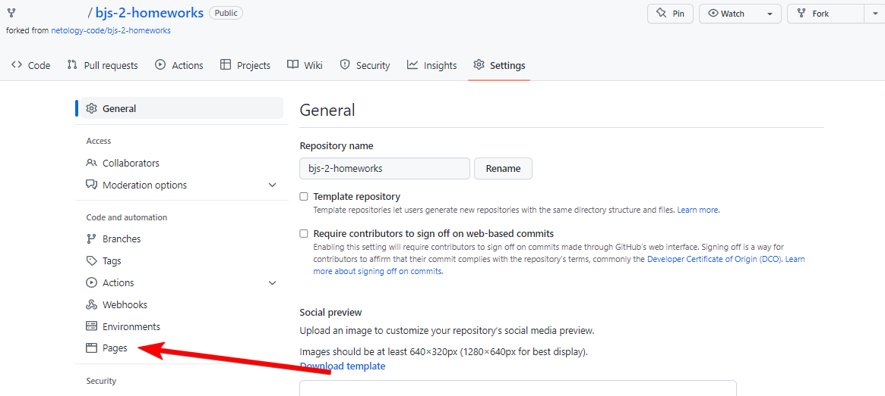
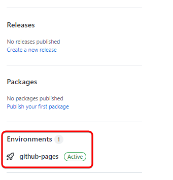

# GitHub Pages
Вам требуется развернуть свой репозиторий с помощью сервиса GitHub Pages,
для этого в настройках репозитория:
1. Переходим в настройки вашего форка репозитория
   
2. Выбираем пункт Pages
   
3. Выберите ветку `main`, директорию `(root)` и нажмите
   кнопку "Save":
   
4. Спустя пару минут на странице репозитория можно будет заменить окружение, в котором развёрнут репозиторий:
   
5. На странице с окружениями будет кнопка **View deployment**, которая будет вести на страницу GitHubPages